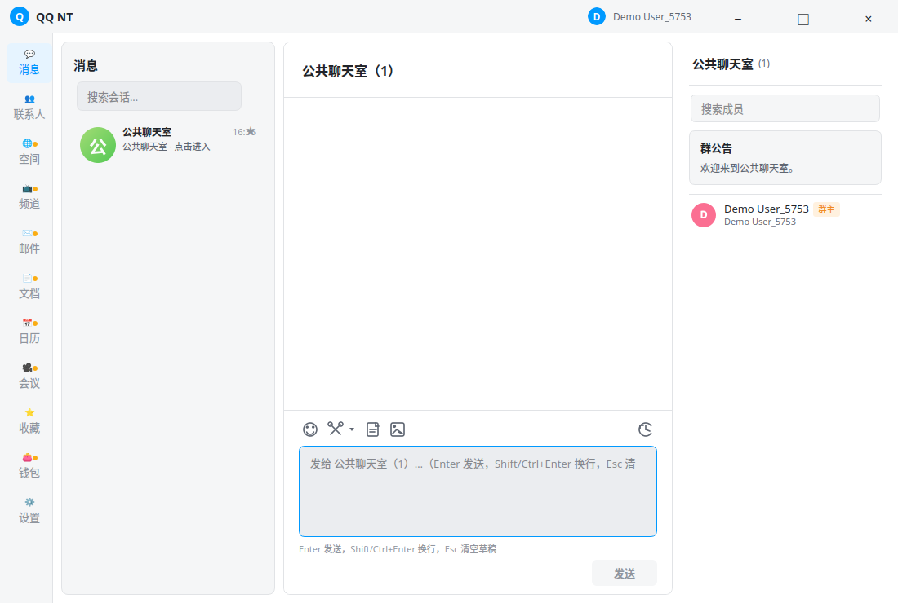

# QtNetworkChat

[](https://github.com/ziyue67/QtNetworkChat/actions/workflows/linux-build.yml)
[](https://github.com/ziyue67/QtNetworkChat/actions/workflows/windows-build.yml)
[](https://github.com/ziyue67/QtNetworkChat/actions/workflows/container.yml)
[](LICENSE)

QtNetworkChat is a Qt 6/C++17 desktop chat application and self-hosted TCP
server. It includes account and friend management, private and group chat,
resumable file transfer, local history, Redis-backed multi-instance routing,
PostgreSQL persistence, TCP/TLS and WebSocket/WSS transports, and an optional
OpenSSL E2E provider.



The screenshot shows the desktop client connected to an isolated local test server.

## Deploy the server

The published Linux/amd64 server image is:

```text
ghcr.io/ziyue67/qtnetworkchat-server:latest
```

Deploy the complete nginx, server, Redis, and PostgreSQL stack:

```bash
git clone https://github.com/ziyue67/QtNetworkChat.git
cd QtNetworkChat/deploy
cp .env.example .env
# Replace REDIS_PASSWORD and POSTGRES_PASSWORD in .env.
sudo ./gen-certs.sh letsencrypt qt.ziyuexc.top you@example.com
docker compose pull
docker compose up -d
docker compose ps
```

Release clients default to `wss://qt.ziyuexc.top/ws`. OpenResty exposes the
HTTPS/WSS endpoint while the gateway, application, Redis, and PostgreSQL stay
private. The bundled Compose nginx stream endpoint on port 9443 remains a
TCP/TLS compatibility deployment. See [deploy/README.md](deploy/README.md) for
certificate testing, source builds, OpenResty integration, updates, and rollbacks.

## Build the desktop client

Install CMake 3.16+, Ninja, Qt 6 Base/Multimedia/WebSockets, and OpenSSL development files.
On Debian or Ubuntu:

```bash
sudo apt-get install cmake ninja-build qt6-base-dev qt6-multimedia-dev qt6-websockets-dev libssl-dev
```

For local development, the defaults remain `127.0.0.1:8888` with TLS disabled:

```bash
cmake -S . -B build -G Ninja -DCMAKE_BUILD_TYPE=Release
cmake --build build --target QtNetworkChat
```

For a distributable client that connects to the hosted service without runtime
configuration:

```bash
cmake -S . -B build-release -G Ninja \
  -DCMAKE_BUILD_TYPE=Release \
  -DQTNETWORKCHAT_DEFAULT_SERVER_HOST=qt.ziyuexc.top \
  -DQTNETWORKCHAT_DEFAULT_SERVER_PORT=443 \
  -DQTNETWORKCHAT_DEFAULT_TRANSPORT=wss \
  -DQTNETWORKCHAT_DEFAULT_WEBSOCKET_PATH=/ws \
  -DQTNETWORKCHAT_DEFAULT_TLS=ON \
  -DQTNETWORKCHAT_DEFAULT_TLS_VERIFY=ON \
  -DQTNETWORKCHAT_E2E_ENABLE_PRODUCTION_CRYPTO=ON \
  -DQTNETWORKCHAT_E2E_LINK_PRODUCTION_ADAPTER=ON
cmake --build build-release --target QtNetworkChat
```

Linux AppImage/tar.gz and Windows zip packages are produced by the release
workflows for version tags and attached to the corresponding
[GitHub Release](https://github.com/ziyue67/QtNetworkChat/releases). The AppImage
contains the Qt runtime and can be started directly after `chmod +x`.

## Runtime configuration

Environment variables override the compile-time client endpoint:

| Variable | Default | Purpose |
| --- | --- | --- |
| `QTNETWORKCHAT_SERVER_HOST` | compiled value or `127.0.0.1` | Chat server hostname |
| `QTNETWORKCHAT_SERVER_PORT` | compiled value or `8888` | Chat server TCP port |
| `QTNETWORKCHAT_TRANSPORT` | compiled value or `tcp` | `tcp`, `tls`, `ws`, or `wss` |
| `QTNETWORKCHAT_WEBSOCKET_URL` | derived from host/port/path | Full `ws://` or `wss://` override |
| `QTNETWORKCHAT_WEBSOCKET_PATH` | compiled value or `/ws` | WebSocket HTTP request path |
| `QTNETWORKCHAT_TLS` | compiled value or off | Enable TLS transport |
| `QTNETWORKCHAT_TLS_VERIFY` | compiled value or on | Verify the certificate chain and hostname |
| `QTNETWORKCHAT_TLS_PINNED_SHA256` | empty | Optional SHA-256 certificate pin |
| `QTNETWORKCHAT_APPDATA_DIR` | platform app-data directory | Runtime data location |
| `QTNETWORKCHAT_REDIS` | off | Enable required Redis routing for a server process |
| `QTNETWORKCHAT_REDIS_HOST` | `127.0.0.1` | Redis hostname |
| `QTNETWORKCHAT_REDIS_PORT` | `6379` | Redis port |
| `QTNETWORKCHAT_REDIS_PASSWORD` | empty | Redis password |
| `QTNETWORKCHAT_DB_DRIVER` | `QSQLITE` | `QSQLITE` or `QPSQL` account store |
| `QTNETWORKCHAT_E2E_CRYPTO_BACKEND` | draft | Set to `production` to select the OpenSSL provider |
| `QTNETWORKCHAT_E2E_REQUIRE_PRODUCTION_CRYPTO` | off | Reject E2E work if the production provider is unavailable |

When a certificate pin is set, the pin becomes the trust decision. A mismatch
always terminates the connection. Server-side TLS also fails closed when its
certificate or key cannot be loaded.

Release builds use `wss://qt.ziyuexc.top/ws`: OpenResty terminates TLS and sends
WebSocket traffic to the dedicated gateway, which bridges the existing newline-
delimited protocol to `qtnetworkchat-server:8888`. The original TLS/TCP route
remains available as a compatibility mode by setting `QTNETWORKCHAT_TRANSPORT=tls`
and selecting the stream proxy port. An HTTP reverse proxy still requires a real
WebSocket listener or WS-to-TCP gateway behind it.

## Components

- `QtNetworkChat`: Qt Widgets desktop client and local development server.
- `qqnt_server`: headless TCP server used by the container image.
- `qqnt_engine`: NDJSON backend process documented in `docs/qqnt-ipcv1.md`.
- `sqlite_to_postgres_migrator`: account database migration utility.
- `deploy/`: production Docker Compose stack and certificate tooling.

## Tests

Run the focused checks used for a normal development build:

```bash
cmake -S . -B build -G Ninja -DCMAKE_BUILD_TYPE=Release
cmake --build build --parallel --target \
  QtNetworkChat qqnt_server message_serialization_test \
  tls_security_test websocket_transport_test e2e_private_message_delivery_test
QT_QPA_PLATFORM=offscreen ctest --test-dir build --output-on-failure \
  -R '^(QtNetworkChatExecutableExists|MessageSerializationRoundTrip|TlsSecurityPinning|WebSocketTransport|E2EPrivateMessageDelivery)$'
```

The Linux workflow builds the desktop client, headless server, and focused
network/security tests. The container workflow publishes immutable `sha-*` tags
alongside `latest` and release version tags.

## Repository history

The public Git history was consolidated into a new baseline on 2026-10-03.
Previous tags and GitHub Releases were retired after their refs and release
assets were archived. Existing forks and cached copies may still contain the
earlier history.

## License

Copyright (c) 2026 ziyue67. Licensed under the [MIT License](LICENSE).
